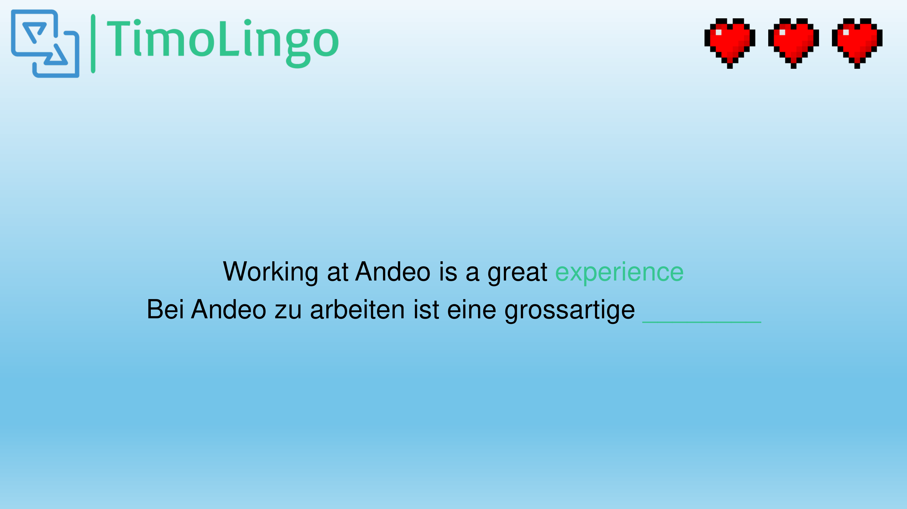

# TimoLingo
## Timo Koller

### Planung
Als Erstes musste ich mir einen Namen überlegen, 
da habe ich recht simple an Duolingo gedacht und daraus "TimoLingo gemacht".
Daraus habe ich mir online ein Logo erstellen lassen (Siehe im Bild unten).
Anschliessend habe ich mir ein einfaches Design überlegt 
und habe dieses in PowerPoint umgesetzt (Siehe ebenfalls unten).

Ich habe noch nie eine Webseite mit React gemacht und wollte dies einmal machen, 
deshalb habe ich mir dieses YouTube Tutorial angesehen:
[YouTube Video Link](https://youtu.be/SqcY0GlETPk?si=-dmnJ2SjtFDFSoUS)